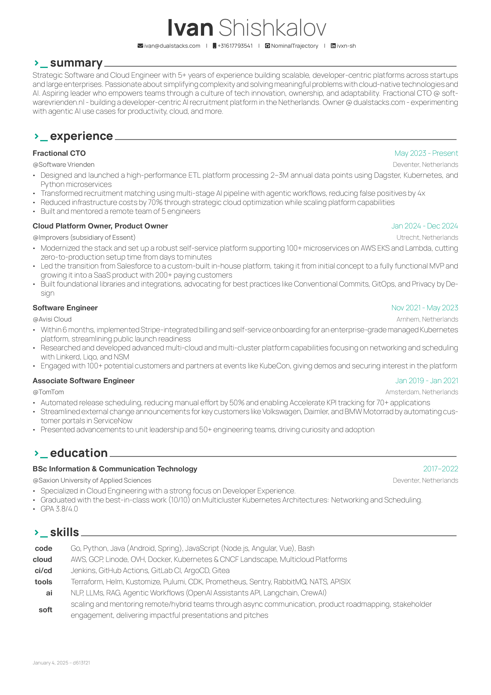

# CV in LaTeX

  <table>
    <tr>
      <td>
        
      </td>
    </tr>
  </table>

This is my CV/resume made using LaTeX - a professional document creation tool. LaTeX helps create clean, well-formatted documents with consistent styling.

## About LaTeX

LaTeX (pronounced "Lay-tech" or "Lah-tech") is a document preparation system widely used in academia and professional settings. Unlike traditional word processors, LaTeX uses plain text and markup tags to define the document's structure and styling, resulting in consistently beautiful and professional output.

## Credits

This CV is built using the amazing [Awesome-CV](https://github.com/posquit0/Awesome-CV) LaTeX class created by [posquit0](https://github.com/posquit0). The elegant design and professional layout of my CV wouldn't be possible without their excellent work.

## Want to Build Your Own?

If you're interested in creating your own professional CV using LaTeX, I highly recommend checking out the original [Awesome-CV repository](https://github.com/posquit0/Awesome-CV). It provides:

- Extensive documentation
- Easy-to-follow templates
- Multiple example layouts
- Customization options

## License

This project is licensed under the MIT License - see the [LICENSE](LICENSE) file for details.
